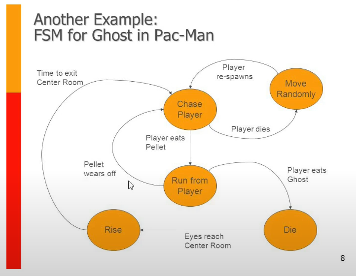

# Finite State Machine

> Complete code from [Java Finite State Machine](https://www.youtube.com/watch?v=tuVUkquMvZg)

## Based on this diagram

## Installation

* Gradle
* Java 17

## Run

* Click run button on StateMachineApp.java at main function